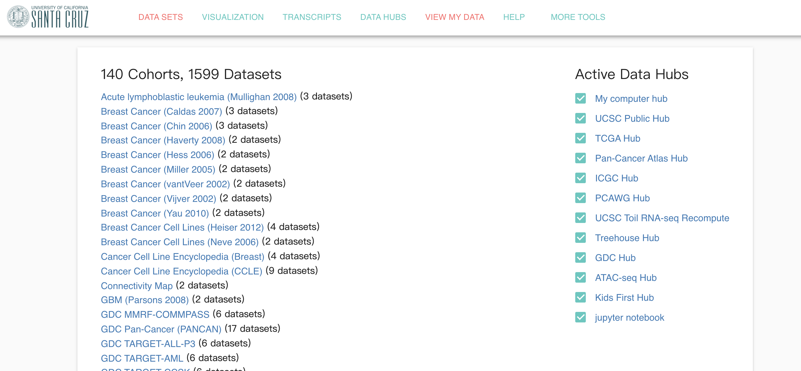

```{r setup, include=FALSE}
knitr::opts_chunk$set(echo = FALSE)
```

## 为什么在 Hiplot 上使用 UCSCXenaShiny

**UCSCXenaShiny 是什么**

UCSC Xena 是著名肿瘤基因组数据库，有近 1600 个清理好的数据集。 UCSCXenaShiny 是它的Web 应用，基于 Shiny 实现，目前 CRAN 显示有 7K 次下载。目前它可以用于数据集下载和多种单基因泛癌水平的分析。





## 为什么在 Hiplot 上使用 UCSCXenaShiny

**如果没有 Hiplot，你该怎么安装使用它**

- 首先你得安装 R 语言环境
- 其次你得安装很多很多依赖包（如果你是 R 用户，可以使用 `remotes::install_git("https://gitee.com/XenaShiny/UCSCXenaShiny")`）
- 你得跳过的门槛
  - 学会安装 R，配置好安装目录和环境
  - 学会安装 R 包，解决常见的报错
  - 知道如何进入R、加载和使用 R 包、调用函数

```r
purrr, tidyr, stringr, magrittr, dplyr, ggplot2, ggpubr, plotly, UCSCXenaTools,
shiny, shinyBS, shinyjs, shinyWidgets, shinyalert, shinyFiles, survival,
survminer, ezcox, waiter, colourpicker, DT, fs, gganatogram
```

## UCSCXenaShiny 的由来

- [**UCSCXenaTools**](https://github.com/ropensci/UCSCXenaTools)：我写的第一个 R 包。
  - 目的：通过 R 直接访问和下载 UCSC Xena 数据，便于可重复性分析。
- [**Openbiox 社区**](https://github.com/openbiox)的建立。
- 志同道合的朋友们。


## UCSCXenaShiny 的使用

R 用户：

```{r eval = FALSE, echo=TRUE}
# remotes::install_git("https://gitee.com/XenaShiny/UCSCXenaShiny") # 安装
library(UCSCXenaShiny) # 加载
app_run() # 开始 Shiny
```

**Hiplot**：<https://hiplot.com.cn/advance/ucsc-xena-shiny>

**Let's GO!**

## 更多信息

如果你想了解更多关于 UCSC Xena 两个 R包更多的使用方法和信息，可以阅读下面👇链接的内容：

- UCSCXenaTools: <https://github.com/ropensci/UCSCXenaTools>
- UCSCXenaShiny: <https://github.com/openbiox/UCSCXenaShiny>

也可以关注我的博客或个人公众号：

- 优雅R（`elegant-r`）


